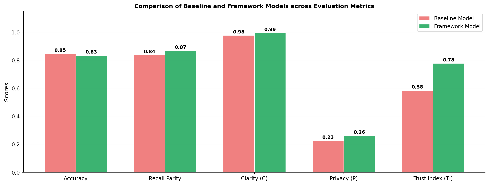
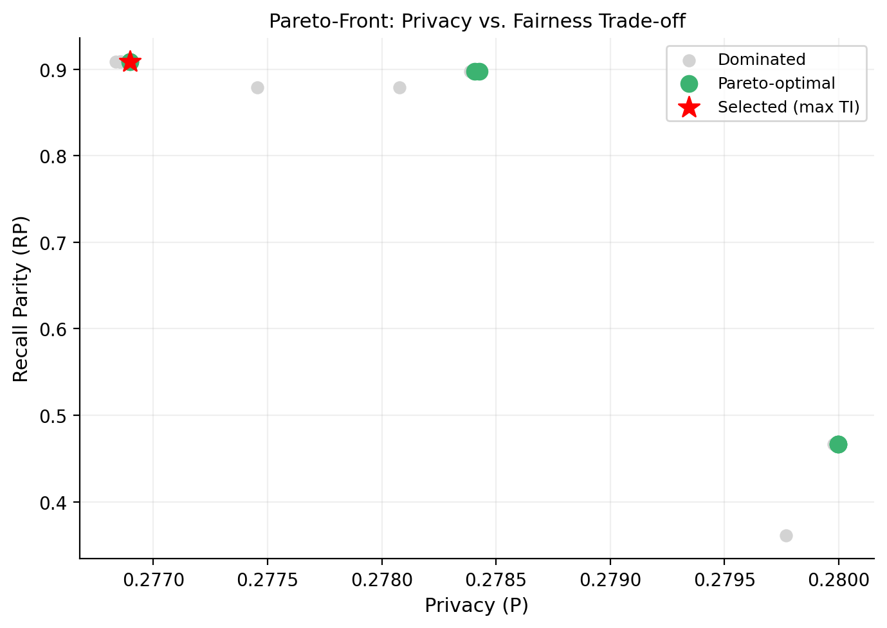
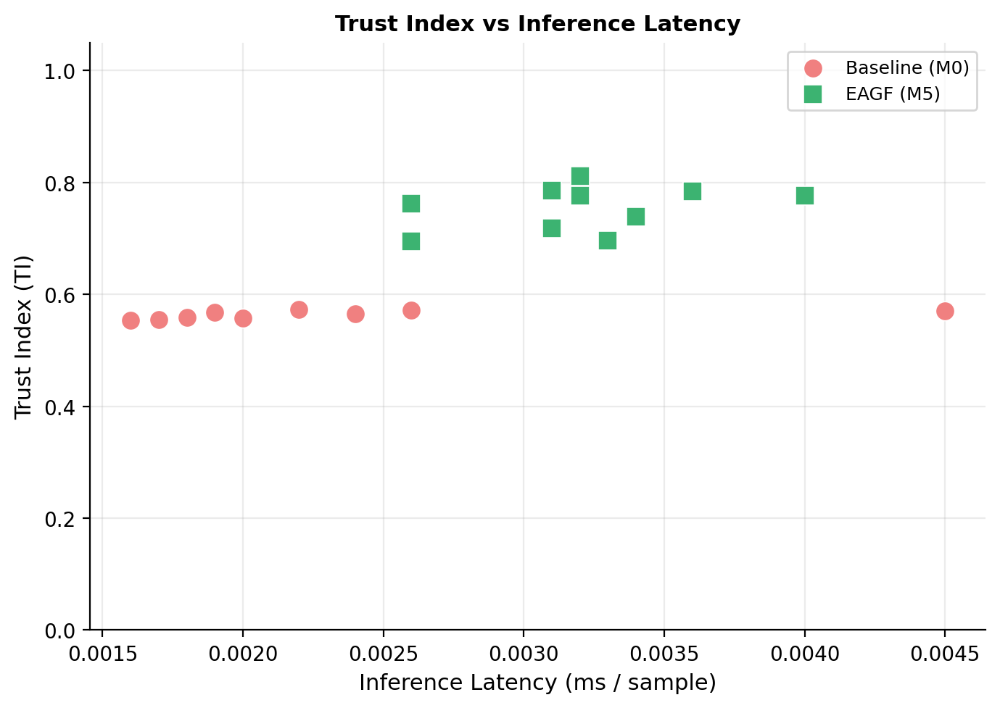

# EAGF: Ethical AI Governance Framework for Cybersecurity in Renewable Energy IoT Systems

> A reproducible **research prototype** for jointly optimizing **fairness**, **privacy**, **clarity**, and **accountability** in AI-driven cybersecurity.


## 📌 1. Title + Overview
EAGF is a four-pillar governance framework for AI-enabled cybersecurity in renewable energy IoT systems.

It integrates **transparency (clarity)**, **fairness**, **privacy**, and **accountability** into one training and evaluation workflow, then summarizes governance quality with a composite **Trust Index**.

Motivation:
- Production AI security models are typically optimized for predictive performance only.
- Governance requirements are often checked late or not enforced quantitatively.
- EAGF addresses this by making governance metrics first-class optimization and reporting targets.

Key contributions:
- **Four-pillar integration:** Unified operationalization of governance pillars in one reproducible pipeline.
- **Multi-objective optimization:** Pareto trade-off analysis across competing objectives.
- **Trust quantification:** Composite Trust Index for model-level governance comparison.
- **Dual-domain validation:** Biometric tabular benchmark and RE-IoT case study.

## 📊 2. Key Results (Updated Automatically)
Latest pipeline outputs are summarized from `results/biometric/main_results.csv`.

> **Key Takeaway:** EAGF achieves the highest Trust Index while improving fairness, privacy, and clarity versus baseline, with a moderate accuracy trade-off.

| Model | Accuracy (mean) | Recall Parity (mean) | Clarity (mean) | Privacy (mean) | Accountability (mean) | Trust Index (mean) |
|---|---:|---:|---:|---:|---:|---:|
| Baseline | 0.8458 | 0.8360 | 0.9763 | 0.2250 | 0.3000 | 0.5843 |
| EAGF | 0.8333 | 0.8669 | 0.9945 | 0.2614 | 0.9833 | 0.7765 |
| Joint DP+Fair | 0.8125 | 0.8788 | 0.8679 | 0.2603 | 0.3000 | 0.5767 |

Key insights:
- EAGF delivers the highest Trust Index, improving from 0.5843 (Baseline) to 0.7765.
- Joint DP+Fair yields the strongest recall parity, but accountability remains unchanged and Trust Index does not improve.
- EAGF improves recall parity, clarity, privacy, and accountability with a moderate accuracy trade-off.

## 📈 3. Figures
### Figure 1: Main Comparison Across Evaluation Metrics
<p align="center">
  
</p>

<p align="center"><em>Caption: Aggregate comparison of governance metrics and Trust Index between baseline and framework variants.</em></p>

### Figure 2: Pareto Front
<p align="center">
  
</p>

<p align="center"><em>Caption: Pareto trade-off surface across fairness and clarity regularization settings in multi-objective tuning.</em></p>

### Figure 3: Trust Index vs Inference Latency
<p align="center">
  
</p>

<p align="center"><em>Caption: Per-seed deployment trade-off between governance quality (Trust Index) and inference-time cost.</em></p>

## 🔁 4. Quick Start
```bash
# Run full experiment
python run_full_pipeline.py --config biometric_tuned_auto.yaml --seeds 42 43 44 45 46 47 48 49 50 51
```

## ⚙️ 5. Installation
### Requirements
- Python 3.9+
- pip
- Optional GPU acceleration via CUDA-compatible PyTorch build

### Setup
```bash
git clone https://github.com/aliakarma/eagf.git
cd eagf
python -m venv .venv
# Windows
.venv\Scripts\activate
# Linux/macOS
# source .venv/bin/activate
pip install --upgrade pip
pip install -r requirements.txt
```

GPU note:
- The default setup works on CPU.
- For GPU, install a CUDA-enabled PyTorch wheel compatible with your driver/toolkit.

## 🔁 6. Reproducibility Guide (CRITICAL)
### Full experiment
```bash
python run_full_pipeline.py --config biometric_tuned_auto.yaml --seeds 42 43 44 45 46 47 48 49 50 51
```

What it does:
- Runs complete biometric and RE-IoT workflows over 10 seeds.
- Executes ablation, main comparison, joint baseline, Pareto search, and report generation.

Expected outputs:
- `results/final_report.txt`
- `results/biometric/main_results.csv`
- `results/biometric/ablation/ablation_summary.csv`
- `figures/figure3.png`, `figures/pareto_front.png`, `figures/ti_vs_latency.png`

### Fast mode (optional)
```bash
python run_full_pipeline.py --fast
```

What it does:
- Runs a one-seed reduced-time path for smoke testing and environment validation.

Expected outputs:
- Same output structure as full experiment, with reduced statistical strength.

## 🗂️ 7. Project Structure
```text
eagf/
├── src/              # Core modules
├── configs/          # Experiment configs
├── scripts/          # Utilities
├── results/          # Outputs
├── figures/          # Plots
```

## 📁 8. Outputs
| File/Directory | Description |
|---|---|
| `results/final_report.txt` | Consolidated run report with summary statistics and checks. |
| `results/biometric/main_results.csv` | Baseline vs EAGF vs Joint DP+Fair aggregate metrics. |
| `results/biometric/ablation/ablation_summary.csv` | M0-M5 ablation aggregates and confidence intervals. |
| `figures/` | Generated visualization artifacts for manuscript/reporting. |

## 🧠 9. Method Summary
EAGF combines four components:
- **Fairness:** parity-aware objective terms to reduce group disparity.
- **Privacy:** DP-SGD dynamics plus MIA-based empirical privacy measurement.
- **Clarity:** explanation-oriented structural constraints and post-hoc clarity scoring.
- **Accountability:** audit, traceability, and compliance scoring from artifacts.

Pareto optimization:
- EAGF sweeps fairness and clarity regularization coefficients to identify governance-performance trade-offs.

Trust Index:
- High-level formulation: weighted aggregation of clarity, fairness, privacy, and accountability scores.

## 🚀 10. Reproducibility & CI
This repository includes GitHub Actions workflows for automated validation and experiment execution:
- `.github/workflows/ci.yml`: multi-version tests plus fast smoke integration.
- `.github/workflows/run_experiments.yml`: reproducibility-oriented fast pipeline execution and artifact upload.

The full pipeline command above reproduces the published tables and figures from source code and configuration.

## 📚 11. Citation
If you use this repository, please cite the associated EAGF paper.

```bibtex
@article{jan2026eagf,
  title   = {Ethical AI Governance for Cybersecurity in Renewable Energy IoT Systems: A Four-Pillar Framework Integrating Transparency, Fairness, Privacy, and Accountability with a Composite Trust Index},
  author  = {Jan, Salman and Muhammad, Munir Azam and Syed, Toqeer Ali and Akarma, Ali and Lee, It Ee and Wali, Qamar and Kamal, Shahid and Ali, Jawad},
  journal = {Under Review},
  year    = {2026}
}
```
