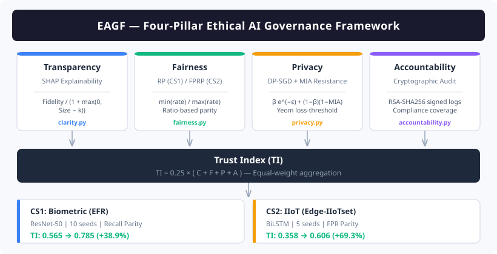

<div align="center">

# EAGF: Ethical AI Governance Framework

**A Four-Pillar Framework for Trustworthy Cybersecurity in 5G Renewable Energy IoT Systems**

[](https://python.org)
[](https://pytorch.org)
[](LICENSE)
[](configs/)

</div>

---

EAGF jointly optimises four governance pillars &mdash; **transparency**, **fairness**, **privacy**, and **accountability** &mdash; within a single training-and-deployment lifecycle. All four scores are aggregated into a composite **Trust Index** that quantifies end-to-end governance readiness. The framework is evaluated on two real-world cybersecurity domains: biometric access control and IIoT intrusion detection.

<p align="center">
  
</p>

---

## Results

### Case Study 1 &mdash; Biometric Access Control

> **Dataset:** EFR (10,021 images, 158 classes) &nbsp;|&nbsp; **Model:** ResNet-50 (ImageNet, GroupNorm) &nbsp;|&nbsp; **Seeds:** 10 &nbsp;|&nbsp; **Fairness metric:** Recall Parity

| Metric | Baseline (M0) | EAGF (M2) | &Delta; |
|:-------|:-------------:|:---------:|:-------:|
| Accuracy | 84.63 &plusmn; 1.03 % | 78.63 &plusmn; 2.52 % | &minus;6.00 pp |
| Recall Parity | 0.786 &plusmn; 0.021 | **0.905 &plusmn; 0.012** | +0.119 |
| Clarity | 0.929 &plusmn; 0.028 | **0.961 &plusmn; 0.021** | +0.032 |
| Privacy | 0.243 &plusmn; 0.009 | **0.289 &plusmn; 0.012** | +0.046 |
| Accountability | 0.300 &plusmn; 0.000 | **0.983 &plusmn; 0.000** | +0.683 |
| **Trust Index** | 0.565 &plusmn; 0.007 | **0.785 &plusmn; 0.008** | **+38.9 %** |

<sub>Exact Wilcoxon signed-rank test, <i>p</i> = 0.002 for all pairwise comparisons.</sub>

### Case Study 2 &mdash; IIoT Intrusion Detection

> **Dataset:** Edge-IIoTset (157,800 flows, 1 : 5.8 imbalance) &nbsp;|&nbsp; **Model:** 2-layer BiLSTM (hidden = 128) &nbsp;|&nbsp; **Seeds:** 5 &nbsp;|&nbsp; **Fairness metric:** FPR Parity

| Metric | Baseline (M0) | EAGF (M2) | &Delta; |
|:-------|:-------------:|:---------:|:-------:|
| Accuracy (macro) | 0.648 &plusmn; 0.025 | **0.665 &plusmn; 0.008** | +2.6 % |
| FPR Parity | 0.493 &plusmn; 0.085 | **0.771 &plusmn; 0.057** | +56.4 % |
| Clarity | 0.692 &plusmn; 0.043 | **0.739 &plusmn; 0.055** | +6.8 % |
| Privacy | 0.248 &plusmn; 0.003 | 0.248 &plusmn; 0.003 | preserved |
| Accountability | 0.000 &plusmn; 0.000 | **0.667 &plusmn; 0.000** | +0.667 |
| **Trust Index** | 0.358 &plusmn; 0.013 | **0.606 &plusmn; 0.011** | **+69.3 %** |

<sub>Paired <i>t</i>-test, <i>t</i>(4) = 32.6, <i>p</i> &lt; 0.001. System overhead: +0.2 ms latency, +5.8 MB memory.</sub>

### Highlights

- **No pillar is redundant** &mdash; leave-one-out ablation confirms every mechanism degrades TI when removed; accountability contributes the largest single share.
- **Privacy holds** &mdash; DP-SGD (&epsilon; = 3) reduces MIA AUC from 0.612 to 0.541 (CS1); near-random in CS2.
- **Edge-deployable** &mdash; +0.2 ms latency, +5.8 MB memory; SHAP runs asynchronously (~12 ms per batch).

---

## Getting Started

### 1. Install

```bash
git clone https://github.com/aliakarma/eagf.git
cd eagf
python -m venv .venv && .venv\Scripts\activate   # Windows
# source .venv/bin/activate                       # Linux / macOS
pip install -r requirements.txt
```

### 2. Prepare Data

| Case Study | Dataset | Instructions |
|:-----------|:--------|:-------------|
| CS1 &mdash; Biometric | EFR (Kaggle) | Place preprocessed arrays in `data/biometric/efr_processed/`. Use `--demo` for synthetic fallback. |
| CS2 &mdash; IIoT | [Edge-IIoTset](https://dx.doi.org/10.21203/rs.3.rs-1433551/v1) | Download CSV (~78 MB) and place at `data/real_iot/edge_iiot.csv`. |

See [`data/README.md`](data/README.md) for full preprocessing instructions.

### 3. Run

**Quick validation** (single seed):

```bash
# CS1 — Biometric (demo data)
python run_eagf.py --config configs/biometric_default.yaml --seeds 42 --demo

# CS2 — IIoT
python run_full_pipeline.py --real_dataset edge_iiot --config configs/reiot_real.yaml --seeds 42
```

**Full experiments** (publication results):

```bash
# CS1 — 10 seeds
python run_eagf.py --config configs/biometric_default.yaml \
  --seeds 42 43 44 45 46 47 48 49 50 51

# CS2 — 5 seeds
python run_full_pipeline.py --real_dataset edge_iiot \
  --config configs/reiot_real.yaml --seeds 42 43 44 45 46
```

Both pipelines produce per-seed results, aggregate statistics (mean &plusmn; std, 95 % CI), ablation tables, and Pareto front visualisation (5 &times; 5 grid, 25 runs) under `results/`.

---

## Method

### Trust Index

The composite governance metric aggregates all four pillars with equal weight:

```
TI  =  0.25  ×  ( Clarity  +  Fairness  +  Privacy  +  Accountability )
```

| Pillar | What it measures | CS1 metric | CS2 metric |
|:-------|:-----------------|:-----------|:-----------|
| **Transparency** | Explanation faithfulness | SHAP fidelity (Eq. 6-7) | SHAP fidelity |
| **Fairness** | Group-level parity | Recall Parity (ratio) | FPR Parity (ratio) |
| **Privacy** | Resistance to inference attacks | &beta; e<sup>-&epsilon;</sup> + (1-&beta;)(1-MIA) | Same |
| **Accountability** | Audit trail completeness | RSA-signed logs + compliance | Same |

### Architectures

| | CS1 &mdash; Biometric | CS2 &mdash; IIoT |
|:--|:------|:------|
| **Model** | ResNet-50 (ImageNet-pretrained, GroupNorm for Opacus, Dropout 0.3) | 2-layer Bidirectional LSTM (hidden = 128, LayerNorm head) |
| **Training** | 50 epochs, batch 32, cosine LR + 5-epoch warmup | 30 epochs, batch 256, cosine LR + 3-epoch warmup |
| **DP-SGD** | &epsilon; = 3.0, max grad norm = 1.0 | &epsilon; = 3.0, max grad norm = 1.0 |
| **Convergence** | Early stop: &Delta;TI < 0.002 over 5 epochs | Same |

---

## Reproducibility

| | CS1 | CS2 |
|:--|:----|:----|
| **Seeds** | 42 &ndash; 51 (10 runs) | 42 &ndash; 46 (5 runs) |
| **Statistical test** | Exact Wilcoxon signed-rank (*p* = 0.002 floor) | Paired *t*-test, *t*(4) = 32.6 |
| **Determinism** | NumPy + PyTorch seeds fixed per run | Same |
| **Early stopping** | &Delta;TI < 0.002 over 5 epochs or &epsilon;-budget exhausted | Same |

---

<details>
<summary><strong>Repository Structure</strong></summary>

```
eagf/
├── run_eagf.py                      # CS1 biometric pipeline
├── run_full_pipeline.py             # CS2 Edge-IIoTset pipeline
│
├── src/
│   ├── models/
│   │   ├── __init__.py              # Model factory  (build_model)
│   │   ├── resnet50.py              # ResNet-50 + GroupNorm
│   │   ├── lstm.py                  # Bidirectional LSTM
│   │   └── tabular_mlp.py           # Tabular MLP fallback
│   │
│   ├── training/
│   │   ├── eagf_trainer.py          # Governance-aware training loop
│   │   ├── fairness_loss.py         # Differentiable RP / FPRP loss
│   │   └── pareto_trainer.py        # 5×5 Pareto front exploration
│   │
│   ├── evaluation/
│   │   ├── ablation.py              # 6-variant + leave-one-out ablation
│   │   ├── statistics.py            # Wilcoxon & paired t-test
│   │   ├── mia_attack.py            # Yeom loss-threshold MIA
│   │   ├── audit_logger.py          # RSA-SHA256 cryptographic audit
│   │   └── report_generator.py      # Aggregate report generation
│   │
│   ├── metrics/
│   │   ├── clarity.py               # SHAP-based clarity score
│   │   ├── fairness.py              # Recall Parity, FPR Parity
│   │   ├── privacy.py               # DP accounting + MIA score
│   │   ├── accountability.py        # Audit + trace + compliance
│   │   └── trust_index.py           # Composite Trust Index
│   │
│   ├── utils/
│   │   ├── data_loader.py           # Dataset dispatcher
│   │   ├── biometric_pipeline.py    # Image pipeline (CS1)
│   │   ├── edge_iiot_loader.py      # Edge-IIoTset loader (CS2)
│   │   ├── preprocessing.py         # Normalisation & DP noise
│   │   └── visualisation.py         # Figures
│   │
│   └── baselines/
│       ├── aif360_dp_pipeline.py    # AIF360 reweighing
│       ├── fairlearn_baseline.py    # Fairlearn ExponentiatedGradient
│       └── joint_dp_fair_baseline.py
│
├── configs/
│   ├── biometric_default.yaml       # CS1 config
│   ├── reiot_real.yaml              # CS2 config
│   └── compliance_checklist*.yaml   # Compliance templates
│
├── docs/
│   └── EAGF.tex                     # Paper source
│
├── data/                            # Dataset storage (not committed)
├── results/                         # Experiment outputs
└── figures/                         # Generated visualisations
```

</details>

---

## Citation

If you use this code in your research, please cite:

```bibtex
@article{jan2026eagf,
  title   = {{EAGF}: A Four-Pillar Ethical {AI} Governance Framework for
             Trustworthy Cybersecurity in {5G} Renewable Energy {IoT} Systems},
  author  = {Jan, Salman and Syed, Toqeer Ali and Akarma, Ali and
             Muhammad, Munir Azam and Kamal, Shahid},
  year    = {2026},
  journal = {Under review}
}
```

---

<div align="center">

**[Documentation](docs/)** &nbsp;&middot;&nbsp; **[Data Setup](data/README.md)** &nbsp;&middot;&nbsp; **[Configs](configs/)** &nbsp;&middot;&nbsp; **[License](LICENSE)**

MIT License &copy; 2026 Ali Akarma

</div>
